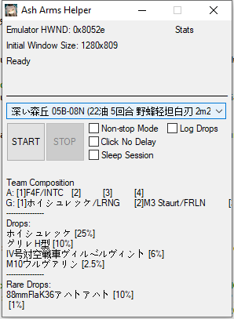
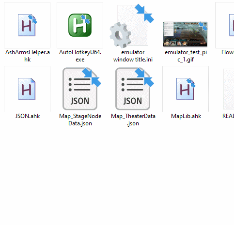

[点此阅读简体中文版说明](README_CN.md)

# Ash Arms Helper
Free yourself from the endless grinding! Hopefully?

But the true intention of this piece of script is just to show it is absolutely not practical to put any kind of "script" detection mechanism in a mobile game app.
This script implements random clicks coordinates and time before each click operation, and a random wait time after each "rotation" finishes. You can also check the "Sleep Session" to so that the simulator will pause for several hours after finishing a specifc number of runs.

# Highlights
1. If you don't feel like to AUTO all the stages, you can write and define your own battle flow, tailored to your own BOX, in just a few line.
2. Handles all kinds of connection errors or bug induced errors and attempts to re-login and restart the script if necessary.

**Notice that you have to start the android emulator of your choice in 720P (1280 * 720) for the script to run properly because it relies heavily on image search functions, and the image to be used cannot be rescaled with the window, at least for now.**

This script relies on AutoHotKey to run, and you can download AHK at https://www.autohotkey.com/

# How to use
Download the compiled AHK script from https://github.com/Kaidrick/AshArmsHelper/releases.
Open `emulator window title.ini` and change the text to the window title of the emulator of your choice. Save the file in UTF-8-BOM.
Run AshArmsHelper.exe to start.

or

Click and drag `AshArmsHelper.ahk` file on your own copy of AutoHotkeyU64.exe

# Writing "battle flows"

Currently, there are only limited amount of stages in the data folder, which means that if you want to grind a stage that is not included, you have to do some work on your end.

**#1 Prepare a image clip for stage selection. Look into `\data\img` foler for examples.**

If the stage name is "03A-08 N", you need to snap a screenshot,clip the image to a proper size, and name it `mapSel_03A_08N`.

**#2 In `Map_StageNodeData.json`, add a key/value pair for this map node, and modify those values as needed:**

`
"mapSel_03A08N": {
		"x": 640, "y": 416, 
		"path": "mapSel_03A-08N.png", 
		"offset": {
			"x": -98, "y": 82
		}, 
		"size": {
			"w": 96, "h": 23
		}, 
		"searchRegion": {
			"X1": 53,
			"Y1": 300,
			"X2": 1203,
			"Y2": 420
		},
		"act": "▶ 03A-08 N",
		"type": "mapNodeSel"
	},
`

**#3 Go to `.\data\flow` and define your own battle flow. There are lots of examples under this folder. Let's take `低耗 05B-08N.txt` for instance:**

The script will read each line, and split it into a few pieces using "," as delimiter.
The first item specifies the type of action. The followings are parameters and options.

**Line 1**
`INFO,05B,08,N` 

tells the script that this line only contains INFO rather than a flow action. "05B" specifies which theater to go to. "08" specifies which stage or node to go to. "N" stands for "normal", and "H" stand for "hard".
Every so-called "flow" file needs a INFO entry as the first line in the file.

**Line 2** 
`DESC,F4F,MC200,,,ホイシュレッケ,グリレ,,,ホイシュレッケ,グリレH型,IV号対空戦車ヴィルベルヴィント,M10ウルヴァリン,88mmFlaK36アハトアハト`

So it is a description entry, which contains team composition as a memo, in case you forget it later, and drop info.
If you don't bother taking any note, you can write this line as `DESC,` or simply `DESC`
F4F is the first air unit, MC200 is the second unit, and the thrid and forth are N/A.
ホイシュレッケ(grass hopper) is the first ground unit, and the rest are N/A.
Starting from the next ホイシュレッケ are the drops. This stage drops memory pieces for Grasshopper, Grille, Panzer. IV and M10, plus Flak88 as the "rare drop".

So the format is as follows:

`DESC,Air1,Air2,Air3,Air4,Ground1,Ground2,Ground3,Ground4,Drop1,Drop2,Drop3,Drop4,RareDrop`

**Line 3 to End of Line**
Those are so-called "actions", and they all follows this format:

`ACTION_TYPE,UNIT_NUM,COMMENT_OR_MEMO_TEXT`

`SELECT,1,` or `SELECT,1,This command select the first unit in the sequence`

Select the first unit - SELECT specify action type, 1 specify the order in the unit list, and you can add a memo or comment as the third argument.

`MOVE,2,`
Move the selected unit to map column 2.

`SWITCH,,`
Switch stance

`SKILL,2,`
Use skill #2

`DESELECT,1,`
Deselect current unit. This command is the same as `SELECT`, but **do notice that you have to deselect a unit before selecting another unit**

`CONFIRM,,` 
Click on confirm button. If you disable the prompt for unspent action point then you won't get the window prompt and don't need this line before each `BATTLE,,`

`BATTLE,,`
Click on Battle button and end this turn.

`WAIT,1000,`
For for 1000 milliseconds or 1 seconds.

There is also an `AUTO,,`
No need to explain that.

# Unit Role Option Check
If you write your DESC entry correctly in the flow files, the script will try to check if the unit on each position is using the proper option.
Option is the role of a unit. It could be Ground Attack or Air Superiority or Long Range Fire Support, etc.

For example:
`DESC,F4F/INTC,,,,ホイシュレッケ/LRNG,,,,ホイシュレッケ,グリレH型,IV号対空戦車ヴィルベルヴィント,M10ウルヴァリン,88mmFlaK36アハトアハト`
"/" tell the script to check for role options. INTC means Intercept. So the script will check if F4F's option is set correctly before hitting the READY button.
These options can be expressed in a four-letter or shorthanded one-letter acronym:

Fighter/Light Attacker
INTC or I - Intercept
ASUP or S - Air Superiority
ACOM or C - Air Combat
RECC or R - Recon
GATK or G - Ground Attack

Artillery
FRSP or F - Fire Support
LRNG or L - Long Range
SNIP or P - Sniper

Light Tank
ASLT or A - Assault
FRLN or B - Frontline
RNGR or V - Ranger

Medium/Heavy Bomber
STRG or W - Strategic Formation
TACT or T - Tactical Formation

Other Options are WIP

# Loot Recorder
This is a highly WIP function. Accuracy is not guaranteed in any means. It also needs a tons of images to be able to do image searches on each type of materials and doll intell fragments.
The result for each battle is saved to an \*.csv file for later analysis.
