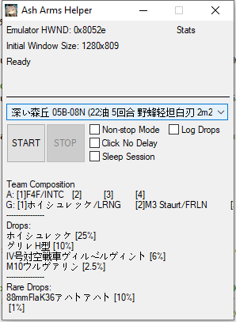
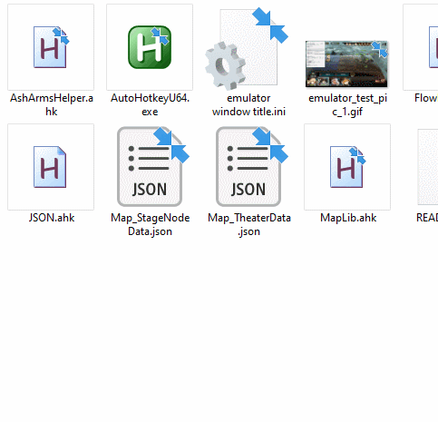

# 灰烬战线 自动周回脚本
你究竟能从无尽的周回肝碎片中脱身吗？

**将根目录下的`lang.ini`内的`en-US`修改为`zh-CN`来启用中文界面！**

然而，这个脚本真正的目的只是为了简单说明为什么在手机游戏App中加入“脚本检测”是无用功，如果运营真的想查处脚本，应当从服务器端的数据着手分析，办法多得是。
但这个脚本也试图绕过这些“潜在的”检测方案。比如，脚本每次点击都会使用随机坐标，以随机间隔操作，并且每个循环结束后都会随机等待随机的时间。
你也可以勾选“Sleep Session”来让脚本在进行指定数量的循环后暂停几个小时。

本脚本仅以个人学习AutoHotKey为目的，其实如果你真想拿去挂机为什么不试试神奇的触动精灵呢？

# 脚本功能
1. 如果你觉得AUTO周回的战损无法接受，为什么不自己动手，只需十几行文字就能针对你自己的BOX，定义无损战斗流程
2. 自动处理网络链接错误/验证错误/bug导致的其他错误，并按需尝试重新登陆并恢复脚本运行

**注意，模拟器必须设置为720P（分辨率1280 \* 720）才能正常使用脚本，因为脚本大量使用了图像搜索功能，而用于搜索的图像源的尺寸不能随着窗口尺寸而改变，至少现在不能**

# 如何使用

从此处下载已编译的AHK可执行文件 https://github.com/Kaidrick/AshArmsHelper/releases 。

在`emulator window title.ini`文件中填写模拟器窗口的标题，保存为UTF-8-BOM编码。

双击AshArmsHelper.exe来运行脚本。

或者

点击并拖动`AshArmsHelper.ahk`文件至AutoHotkeyU64.exe图标上以运行

# 定义“战斗流程”

目前，data文件夹里只提供了个人比较常用的地图数据，也就是说，如果你想刷其他图，需要自己动手做一些准备。

**#1 准备关卡选择界面的关卡名截图。在`\data\img`文件夹中可以找到示例。**

如果关卡名称是“03A-08 N”，那么你需要截图，裁剪图片至合适尺寸，并将其命名为`mapSel_03A_08N`。

**#2 在`Map_StageNodeData.json`文件中，加入这个关卡的键值表，然后按需修改下列参数**

`
"mapSel_03A08N": {
		"x": 640, "y": 416, 
		"path": "mapSel_03A-08N.png", 
		"offset": {
			"x": -98, "y": 82
		}, 
		"size": {
			"w": 96, "h": 23
		}, 
		"searchRegion": {
			"X1": 53,
			"Y1": 300,
			"X2": 1203,
			"Y2": 420
		},
		"act": "▶ 03A-08 N",
		"type": "mapNodeSel"
	},
`

**#3 在`.\data\flow`中放入一个.txt文件来自定义战斗流程。该文件夹中有许多示例。我们以`低耗 05B-08N.txt`为例：**

脚本会读取这个文档中的每一行，以“,”为分隔符将它们分割并放入一个列表中。
列表的第一项代表流程类型。后面几项则是参数和选项。

**第1行**
`INFO,05B,08,N` 

这告诉脚本，这一行包含了“信息”（INFO）而不是具体的流程动作。“05B”指明去哪一个战场，“08”指明去哪一个关卡，“N”代表普通图，“H”代表困难图。
每一个所谓的“流程”文件都需要INFO行作为文件的第一行。

**第2行** 
`DESC,F4F,MC200,,,ホイシュレッケ,グリレ,,,ホイシュレッケ,グリレH型,IV号対空戦車ヴィルベルヴィント,M10ウルヴァリン,88mmFlaK36アハトアハト`

这是文件妙数，它包含了部队组成备忘录，以免你忘记队伍组成，还有关卡掉落信息。
如果你懒得做什么备忘录和信息记录，这一行可以写`DESC,`或者`DESC`。
例如，这一行中，F4F是第一个空中单位，MC200是第二个，第三和第四留空。
ホイシュレッケ(蝗虫)是第一个地面单位，其余位置留空。
从第二个蝗虫开始后面的都是掉落信息。比如这个关卡掉落的碎片是蝗虫、蟋蟀、四号和M10，加上88炮作为“稀有”掉落。

所以描述信息的格式如下：

`DESC,空中单位1,空中单位2,空中单位3,空中单位4,地面单位1,地面单位2,地面单位3,地面单位4,掉落1,掉落2,掉落3,掉落4,稀有掉落`

**第3行至最后一行**
这些是所谓的流程动作，它们的格式如下：

`流程类型,单位编号,注释`

`SELECT,1,` or `SELECT,1,这个命令选择序列中第一个单位`

选择第一个单位 - SELECT标明动作类型，1代表单位列表中单位的序号，你可以加上一句注释作为第三个变量

`MOVE,2,`
讲选中的单位移动至地图第二格。

`SWITCH,,`
切换形态。

`SKILL,2,`
使用技能2

`DESELECT,1,`
反选指定单位。这个命令和`SELECT`没有区别，但要注意**须先反选当前单位，然后才能选择另一个单位**。

`CONFIRM,,` 
点击确认按钮。如果你禁用了还有单位未指派命令的行动，那自然也用不着在每个`BATTLE,,`前都加上这句。

`BATTLE,,`
点击战斗按钮并结束回合。

`WAIT,1000,`
等待1000毫秒（1秒）。

还有一个`AUTO,,`
不用解释吧。

# 单位职能选项检查
如果你正确地编写了战斗流程文件中的DESC条目，那么脚本会根据每一个单位的位置来进行检查，确保职能选项设置正确。
选项也就是这个单位的“技能组”。它可能是“对地型”或者“制空型”或者“长射程型”等等。

例如：
`DESC,F4F/INTC,,,,ホイシュレッケ/LRNG,,,,ホイシュレッケ,グリレH型,IV号対空戦車ヴィルベルヴィント,M10ウルヴァリン,88mmFlaK36アハトアハト`

"/"告诉脚本检查技能组选项。INTC表示“迎击型”（拦截）。按下出击按钮前，脚本会检查F4F的技能组知否设置成了“迎击型”。

脚本不会检查单位是否是“F4F”，因此你可以写成

`DESC,/INTC,,,,Grasshopper/LRNG,,,,,,,`

这些选项可以通过4个英文字母或者单个英文字母的缩写来表示：

战斗机/轻型攻击机

INTC or I - 迎击型

ASUP or S - 制空型

ACOM or C - 空战型

RECC or R - 侦察型

GATK or G - 对地型

火炮

FRSP or F - 火力型

LRNG or L - 长射程型

驱逐战车（反坦克炮）

SNIP or P - 邀击型

轻型坦克

ASLT or A - 突击型

FRLN or B - 前线型

RNGR or V - 游击型

中/重型轰炸机

STRG or W - 战略编队

TACT or T - 战术编队

其他技能组还在WIP

# 掉落记录

仍然处于开发中的功能。无法保证准确性。需要大量图片数据支持来对情报碎片和掉落材料进行图片搜索。

每场战斗的掉落信息会存储在一个\*.csv文件中，你可以将它导入至Excel内。
